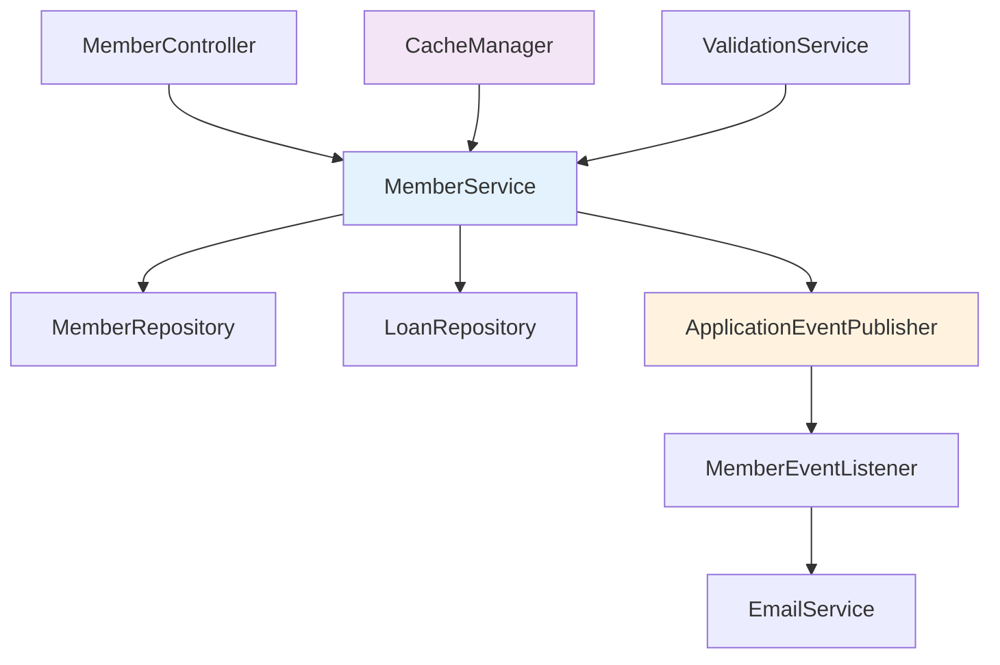

# Spring Boot로 배우는 회원 관리 시스템 구현: 테스트부터 이벤트까지

> **TL;DR**: Spring Boot 3.5에서 완전한 회원 관리 시스템을 구현하며 배운 실무 패턴들 - DTO 설계, 이벤트 기반 아키텍처, 캐싱 전략, 그리고 완벽한 테스트 작성법을 소개합니다.

## 🎯 들어가며

회원 관리는 거의 모든 웹 애플리케이션의 핵심 기능입니다. 하지만 단순해 보이는 CRUD 작업 뒤에는 **이메일 중복 검증**, **멤버십 관리**, **이벤트 처리**, **캐싱** 등 복잡한 비즈니스 로직이 숨어있죠.

이번 포스팅에서는 Spring Boot 3.5를 사용해 **실무에서 바로 사용할 수 있는 회원 관리 시스템**을 처음부터 끝까지 구현해보겠습니다.

## 📋 구현할 기능 목록

우리가 만들 회원 관리 시스템의 요구사항입니다:

### 기본 기능
- ✅ 회원 가입 (이메일 중복 검증)
- ✅ 회원 정보 조회/수정/삭제
- ✅ 이름/멤버십 타입별 검색

### 비즈니스 로직
- ✅ 멤버십 업그레이드 (REGULAR → PREMIUM)
- ✅ 대여 제한 정보 관리 (REGULAR: 5권, PREMIUM: 10권)
- ✅ 회원 가입/업그레이드 시 자동 이메일 발송

### 기술적 요구사항
- ✅ Event-Driven Architecture 적용
- ✅ 캐싱 전략 구현
- ✅ 완벽한 단위/통합 테스트
- ✅ Bean Validation 적용

## 🏗️ 아키텍처 설계

### 1. 전체 구조



### 2. 패키지 구조

```
src/main/java/com/example/spring/
├── controller/
│   └── MemberController.java          # REST API 엔드포인트
├── service/
│   ├── MemberService.java             # 서비스 인터페이스
│   └── impl/MemberServiceImpl.java    # 서비스 구현체
├── dto/
│   ├── request/                       # 요청 DTO
│   │   ├── CreateMemberRequest.java
│   │   └── UpdateMemberRequest.java
│   └── response/                      # 응답 DTO
│       ├── MemberResponse.java
│       └── MemberLoanLimitInfo.java
├── event/                             # 이벤트 관련
│   ├── MemberRegisteredEvent.java
│   ├── MembershipUpgradedEvent.java
│   └── MemberEventListener.java
├── exception/                         # 커스텀 예외
│   ├── BusinessException.java
│   ├── DuplicateEmailException.java
│   └── EntityNotFoundException.java
└── config/                           # 설정
    ├── AsyncConfig.java
    └── CacheConfig.java
```

## 💻 단계별 구현 과정

### Step 1: DTO 설계

먼저 **타입 세이프**하고 **검증 가능한** DTO를 설계합니다.

#### 요청 DTO
```java
@Data
@Builder
@NoArgsConstructor
@AllArgsConstructor
public class CreateMemberRequest {
    
    @NotBlank(message = "이름은 필수입니다")
    @Size(min = 2, max = 50, message = "이름은 2자 이상 50자 이하여야 합니다")
    private String name;
    
    @Email(message = "올바른 이메일 형식이 아닙니다")
    @NotBlank(message = "이메일은 필수입니다")
    private String email;
    
    // 멤버십 타입은 선택사항 (기본값: REGULAR)
    private MembershipType membershipType;
}
```

#### 응답 DTO
```java
@Data
@Builder
@NoArgsConstructor
@AllArgsConstructor
public class MemberResponse {
    
    private Long id;
    private String name;
    private String email;
    private MembershipType membershipType;
    private LocalDateTime joinDate;
    
    /**
     * Entity를 Response DTO로 변환
     */
    public static MemberResponse from(Member member) {
        return MemberResponse.builder()
                .id(member.getId())
                .name(member.getName())
                .email(member.getEmail())
                .membershipType(member.getMembershipType())
                .joinDate(member.getJoinDate())
                .build();
    }
}
```

**💡 핵심 포인트:**
- `@Builder` 패턴으로 불변 객체 생성
- Bean Validation으로 입력값 검증 자동화
- 정적 팩토리 메서드(`from`)로 변환 로직 캡슐화

### Step 2: 비즈니스 예외 설계

예외 처리는 **계층화**해서 관리합니다.

```java
// 기본 비즈니스 예외
@Getter
public class BusinessException extends RuntimeException {
    private final String errorCode;
    
    public BusinessException(String errorCode, String message) {
        super(message);
        this.errorCode = errorCode;
    }
}

// 구체적인 예외들
public class DuplicateEmailException extends BusinessException {
    public DuplicateEmailException(String email) {
        super("DUPLICATE_EMAIL", "이미 사용 중인 이메일입니다: " + email);
    }
}

public class EntityNotFoundException extends BusinessException {
    public EntityNotFoundException(String entityName, Long id) {
        super("ENTITY_NOT_FOUND", entityName + "을(를) 찾을 수 없습니다. ID: " + id);
    }
}
```

### Step 3: 서비스 레이어 구현

#### 인터페이스 정의
```java
public interface MemberService {
    // 회원 관리
    MemberResponse createMember(CreateMemberRequest request);
    MemberResponse updateMember(Long id, UpdateMemberRequest request);
    MemberResponse findMemberById(Long id);
    List<MemberResponse> findAllMembers(Pageable pageable);
    void deleteMember(Long id);
    
    // 회원 검색
    List<MemberResponse> findMembersByName(String name);
    List<MemberResponse> findMembersByMembershipType(MembershipType type);
    
    // 비즈니스 로직
    void upgradeMembership(Long memberId, MembershipType newType);
    boolean validateEmailDuplicate(String email);
    MemberLoanLimitInfo getMemberLoanLimitInfo(Long memberId);
}
```

#### 핵심 구현 로직

**1. 회원 가입 - 이벤트 기반 처리**
```java
@Service
@RequiredArgsConstructor
@Transactional(readOnly = true)
public class MemberServiceImpl implements MemberService {

    private final MemberRepository memberRepository;
    private final ApplicationEventPublisher eventPublisher;

    @Override
    @Transactional
    public MemberResponse createMember(CreateMemberRequest request) {
        log.info("회원 생성 요청 - 이메일: {}, 이름: {}", request.getEmail(), request.getName());
        
        // 1. 이메일 중복 검증
        if (memberRepository.existsByEmail(request.getEmail())) {
            throw new DuplicateEmailException(request.getEmail());
        }
        
        // 2. Member 엔티티 생성
        Member member = Member.builder()
                .name(request.getName())
                .email(request.getEmail())
                .membershipType(request.getMembershipType() != null ? 
                              request.getMembershipType() : MembershipType.REGULAR)
                .joinDate(LocalDateTime.now())
                .build();
        
        // 3. 데이터베이스 저장
        Member savedMember = memberRepository.save(member);
        
        // 4. 회원가입 이벤트 발행 (환영 이메일 발송용)
        eventPublisher.publishEvent(new MemberRegisteredEvent(savedMember));
        
        log.info("회원 생성 완료 - ID: {}, 이메일: {}", savedMember.getId(), savedMember.getEmail());
        return MemberResponse.from(savedMember);
    }
}
```

**2. 캐싱이 적용된 회원 조회**
```java
@Override
@Cacheable(value = "members", key = "#id")
public MemberResponse findMemberById(Long id) {
    log.debug("회원 조회 - ID: {}", id);
    
    Member member = memberRepository.findById(id)
            .orElseThrow(() -> new EntityNotFoundException("Member", id));
    
    return MemberResponse.from(member);
}

@Override
@Transactional
@CacheEvict(value = "members", key = "#id")
public MemberResponse updateMember(Long id, UpdateMemberRequest request) {
    // 수정 로직...
    // 캐시 자동 무효화됨
}
```

**3. 멤버십 업그레이드 - 비즈니스 규칙 적용**
```java
@Override
@Transactional
@CacheEvict(value = "members", key = "#memberId")
public void upgradeMembership(Long memberId, MembershipType newType) {
    log.info("멤버십 업그레이드 요청 - 회원ID: {}, 대상타입: {}", memberId, newType);
    
    Member member = memberRepository.findById(memberId)
            .orElseThrow(() -> new EntityNotFoundException("Member", memberId));
    
    MembershipType currentType = member.getMembershipType();
    
    // 업그레이드 가능성 검증
    if (!isUpgradeAllowed(currentType, newType)) {
        throw new MembershipUpgradeException(currentType, newType);
    }
    
    // 멤버십 업그레이드
    member.setMembershipType(newType);
    Member upgradedMember = memberRepository.save(member);
    
    // 멤버십 업그레이드 이벤트 발행
    eventPublisher.publishEvent(new MembershipUpgradedEvent(upgradedMember, currentType, newType));
    
    log.info("멤버십 업그레이드 완료 - 회원ID: {}, {}에서 {}로 변경", 
            memberId, currentType, newType);
}

private boolean isUpgradeAllowed(MembershipType currentType, MembershipType newType) {
    // SUSPENDED는 업그레이드 불가
    if (currentType == MembershipType.SUSPENDED) {
        return false;
    }
    
    // REGULAR -> PREMIUM만 허용
    return currentType == MembershipType.REGULAR && newType == MembershipType.PREMIUM;
}
```

### Step 4: Event-Driven Architecture 구현

#### 이벤트 정의
```java
@Getter
@AllArgsConstructor
public class MemberRegisteredEvent {
    private final Member member;
    private final LocalDateTime occurredAt;
    
    public MemberRegisteredEvent(Member member) {
        this.member = member;
        this.occurredAt = LocalDateTime.now();
    }
}
```

#### 이벤트 리스너
```java
@Slf4j
@Component
@RequiredArgsConstructor
public class MemberEventListener {

    /**
     * 회원 가입 이벤트 처리 - 환영 이메일 발송
     */
    @EventListener
    @Async
    public void handleMemberRegistered(MemberRegisteredEvent event) {
        log.info("회원 가입 이벤트 처리 - 회원ID: {}, 이메일: {}", 
                event.getMember().getId(), event.getMember().getEmail());
        
        try {
            // TODO: 실제 이메일 발송 로직 구현
            log.info("환영 이메일 발송 시뮬레이션 - 수신자: {}", event.getMember().getEmail());
            
            // 시뮬레이션을 위한 지연
            Thread.sleep(1000);
            
        } catch (Exception e) {
            log.error("환영 이메일 발송 실패 - 회원ID: {}", event.getMember().getId(), e);
        }
    }

    @EventListener
    @Async
    public void handleMembershipUpgraded(MembershipUpgradedEvent event) {
        log.info("멤버십 업그레이드 축하 이메일 발송 시뮬레이션 - 수신자: {}", event.getMember().getEmail());
        // 업그레이드 축하 이메일 발송 로직...
    }
}
```

**💡 이벤트 기반 아키텍처의 장점:**
- **느슨한 결합**: 회원가입 로직과 이메일 발송 로직이 분리
- **확장성**: 새로운 이벤트 리스너 추가 용이
- **성능**: 비동기 처리로 응답 시간 개선

### Step 5: REST API 컨트롤러

```java
@Slf4j
@RestController
@RequestMapping("/api/members")
@RequiredArgsConstructor
public class MemberController {

    private final MemberService memberService;

    /**
     * 회원 가입
     */
    @PostMapping
    public ResponseEntity<MemberResponse> createMember(@Valid @RequestBody CreateMemberRequest request) {
        log.info("회원 가입 요청 - 이메일: {}, 이름: {}", request.getEmail(), request.getName());
        
        MemberResponse response = memberService.createMember(request);
        return ResponseEntity.status(HttpStatus.CREATED).body(response);
    }

    /**
     * 회원 상세 조회
     */
    @GetMapping("/{id}")
    public ResponseEntity<MemberResponse> getMember(@PathVariable Long id) {
        MemberResponse response = memberService.findMemberById(id);
        return ResponseEntity.ok(response);
    }

    /**
     * 멤버십 업그레이드
     */
    @PutMapping("/{id}/membership")
    public ResponseEntity<Void> upgradeMembership(
            @PathVariable Long id, 
            @RequestParam MembershipType membershipType) {
        
        memberService.upgradeMembership(id, membershipType);
        return ResponseEntity.ok().build();
    }

    /**
     * 이메일 중복 확인
     */
    @GetMapping("/email/validate")
    public ResponseEntity<Boolean> validateEmail(@RequestParam String email) {
        boolean available = memberService.validateEmailDuplicate(email);
        return ResponseEntity.ok(available);
    }

    /**
     * 회원 대여 제한 정보 조회
     */
    @GetMapping("/{id}/loan-limit")
    public ResponseEntity<MemberLoanLimitInfo> getMemberLoanLimitInfo(@PathVariable Long id) {
        MemberLoanLimitInfo info = memberService.getMemberLoanLimitInfo(id);
        return ResponseEntity.ok(info);
    }
}
```

## 🧪 완벽한 테스트 전략

### 1. 단위 테스트 - 비즈니스 로직에 집중

```java
@ExtendWith(MockitoExtension.class)
class MemberServiceTest {

    @Mock private MemberRepository memberRepository;
    @Mock private LoanRepository loanRepository;
    @Mock private ApplicationEventPublisher eventPublisher;
    @InjectMocks private MemberServiceImpl memberService;

    @Test
    @DisplayName("회원 생성 - 성공")
    void createMember_성공() {
        // Given
        CreateMemberRequest request = CreateMemberRequest.builder()
                .name("홍길동")
                .email("hong@example.com")
                .build();
        
        Member savedMember = Member.builder()
                .id(1L)
                .name("홍길동")
                .email("hong@example.com")
                .membershipType(MembershipType.REGULAR)
                .build();

        given(memberRepository.existsByEmail("hong@example.com")).willReturn(false);
        given(memberRepository.save(any(Member.class))).willReturn(savedMember);

        // When
        MemberResponse response = memberService.createMember(request);

        // Then
        assertThat(response.getId()).isEqualTo(1L);
        assertThat(response.getName()).isEqualTo("홍길동");
        assertThat(response.getMembershipType()).isEqualTo(MembershipType.REGULAR);
        
        // 이벤트 발행 확인
        verify(eventPublisher).publishEvent(any(MemberRegisteredEvent.class));
    }

    @Test
    @DisplayName("회원 생성 - 이메일 중복 시 예외 발생")
    void createMember_이메일중복_예외발생() {
        // Given
        CreateMemberRequest request = CreateMemberRequest.builder()
                .email("duplicate@example.com")
                .build();

        given(memberRepository.existsByEmail("duplicate@example.com")).willReturn(true);

        // When & Then
        assertThatThrownBy(() -> memberService.createMember(request))
                .isInstanceOf(DuplicateEmailException.class)
                .hasMessageContaining("duplicate@example.com");
    }
}
```

### 2. 통합 테스트 - 전체 플로우 검증

```java
@SpringBootTest
@Transactional
@ActiveProfiles("test")
class MemberServiceIntegrationTest {

    @Autowired private MemberService memberService;

    @Test
    @DisplayName("회원 가입부터 대여 제한 조회까지 전체 플로우 테스트")
    void 회원가입_전체플로우_정상동작() {
        // Given - 회원 가입 요청
        CreateMemberRequest request = CreateMemberRequest.builder()
                .name("통합테스트사용자")
                .email("integration.test@example.com")
                .membershipType(MembershipType.REGULAR)
                .build();

        // When - 회원 가입
        MemberResponse memberResponse = memberService.createMember(request);

        // Then - 회원 생성 확인
        assertThat(memberResponse.getId()).isNotNull();
        assertThat(memberResponse.getMembershipType()).isEqualTo(MembershipType.REGULAR);

        // When - 대여 제한 정보 조회
        MemberLoanLimitInfo loanLimitInfo = memberService.getMemberLoanLimitInfo(memberResponse.getId());

        // Then - REGULAR 멤버십 제한 확인
        assertThat(loanLimitInfo.getMaxLoanCount()).isEqualTo(5);
        assertThat(loanLimitInfo.getCurrentLoanCount()).isEqualTo(0);
        assertThat(loanLimitInfo.isCanLoan()).isTrue();

        // When - 멤버십 업그레이드
        memberService.upgradeMembership(memberResponse.getId(), MembershipType.PREMIUM);

        // Then - 업그레이드 후 제한 확인
        MemberLoanLimitInfo upgradedInfo = memberService.getMemberLoanLimitInfo(memberResponse.getId());
        assertThat(upgradedInfo.getMaxLoanCount()).isEqualTo(10);
    }
}
```

## ⚙️ 설정 및 최적화

### 1. 캐시 설정
```java
@Configuration
@EnableCaching
public class CacheConfig {
    @Bean
    public CacheManager cacheManager() {
        return new ConcurrentMapCacheManager(
            "members",           // 회원 정보 캐시
            "memberLoanLimits"   // 회원 대여 제한 정보 캐시
        );
    }
}
```

### 2. 비동기 처리 설정
```java
@Configuration
@EnableAsync
public class AsyncConfig {
    @Bean(name = "emailTaskExecutor")
    public Executor emailTaskExecutor() {
        ThreadPoolTaskExecutor executor = new ThreadPoolTaskExecutor();
        executor.setCorePoolSize(2);
        executor.setMaxPoolSize(5);
        executor.setQueueCapacity(100);
        executor.setThreadNamePrefix("Email-");
        executor.initialize();
        return executor;
    }
}
```

## 📊 API 테스트 결과

구현이 완료된 후 실제 API를 테스트한 결과입니다:

### 1. 회원 가입
```bash
curl -X POST http://localhost:8080/api/members \
  -H "Content-Type: application/json" \
  -d '{
    "name": "김개발자",
    "email": "dev@example.com"
  }'

# 응답
{
  "id": 1,
  "name": "김개발자",
  "email": "dev@example.com",
  "membershipType": "REGULAR",
  "joinDate": "2024-01-26T10:30:00"
}
```

### 2. 대여 제한 정보 조회
```bash
curl http://localhost:8080/api/members/1/loan-limit

# 응답
{
  "memberId": 1,
  "memberName": "김개발자",
  "membershipType": "REGULAR",
  "maxLoanCount": 5,
  "currentLoanCount": 0,
  "remainingLoanCount": 5,
  "canLoan": true
}
```

### 3. 멤버십 업그레이드
```bash
curl -X PUT http://localhost:8080/api/members/1/membership?membershipType=PREMIUM

# 로그 출력
INFO - 멤버십 업그레이드 요청 - 회원ID: 1, 대상타입: PREMIUM
INFO - 멤버십 업그레이드 완료 - 회원ID: 1, REGULAR에서 PREMIUM로 변경
INFO - 멤버십 업그레이드 축하 이메일 발송 시뮬레이션 - 수신자: dev@example.com
```

## 🎯 핵심 학습 포인트

### 1. **레이어드 아키텍처의 장점**
- **Controller**: HTTP 요청/응답 처리에만 집중
- **Service**: 비즈니스 로직과 트랜잭션 관리
- **Repository**: 데이터 접근 로직 캡슐화

### 2. **Event-Driven Architecture**
```java
// 💚 Good: 느슨한 결합
eventPublisher.publishEvent(new MemberRegisteredEvent(member));

// ❌ Bad: 강한 결합  
emailService.sendWelcomeEmail(member);
```

### 3. **DTO 활용의 중요성**
- **타입 안전성**: 컴파일 타임에 오류 감지
- **검증 자동화**: Bean Validation으로 입력값 검증
- **API 문서화**: 명확한 입력/출력 스펙

### 4. **캐싱 전략**
- **@Cacheable**: 자주 조회되는 데이터 캐싱
- **@CacheEvict**: 데이터 변경 시 캐시 무효화
- **Cache-Aside 패턴**: Spring이 자동으로 처리

### 5. **테스트 전략**
- **단위 테스트**: Mock을 사용해 비즈니스 로직만 테스트
- **통합 테스트**: 실제 DB와 연동해 전체 플로우 검증
- **Given-When-Then**: 명확한 테스트 구조

## 🚀 실무 적용 팁

### 1. **예외 처리 전략**
```java
// 계층화된 예외 설계로 클라이언트에게 명확한 정보 제공
@ControllerAdvice
public class GlobalExceptionHandler {
    @ExceptionHandler(DuplicateEmailException.class)
    public ResponseEntity<ErrorResponse> handleDuplicateEmail(DuplicateEmailException ex) {
        return ResponseEntity.badRequest().body(
            ErrorResponse.of("DUPLICATE_EMAIL", ex.getMessage())
        );
    }
}
```

### 2. **로깅 전략**
- **INFO**: 비즈니스 주요 이벤트 (회원가입, 업그레이드)
- **DEBUG**: 조회 작업
- **ERROR**: 예외 상황

### 3. **성능 최적화**
- **N+1 문제 방지**: @EntityGraph 활용
- **지연 로딩**: @Transactional(readOnly = true)
- **캐싱**: 자주 조회되는 데이터에 적용

## 🔄 다음 단계

이제 견고한 회원 관리 시스템이 완성되었습니다! 다음으로 구현할 수 있는 기능들:

1. **LoanService**: 도서 대여 관리 시스템
2. **EmailService**: 실제 이메일 발송 구현
3. **PaymentService**: 멤버십 업그레이드 결제 처리
4. **AdminService**: 관리자 기능

## 📚 참고 자료

- [Spring Boot 공식 문서 - Caching](https://docs.spring.io/spring-boot/docs/current/reference/html/spring-boot-features.html#boot-features-caching)
- [Spring Events 가이드](https://spring.io/blog/2015/02/11/better-application-events-in-spring-framework-4-2)
- [Bean Validation 스펙](https://beanvalidation.org/2.0/spec/)

---

## 🏷️ 태그

`#SpringBoot` `#MemberService` `#EventDriven` `#Caching` `#Testing` `#Java21` `#RESTApi` `#클린아키텍처`

---

**💡 이 포스팅이 도움이 되셨다면 좋아요와 댓글로 응원해주세요!  
궁금한 점이 있으시면 언제든 댓글로 질문해주세요. 🚀**