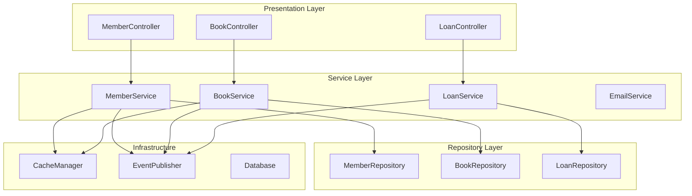

# Spring Boot로 배우는 도서관리 시스템 개발 연재

> **Spring Boot 3.5**와 **Java 21**을 활용한 실무 중심의 도서관리 시스템 개발 연재입니다.  
> 단순한 CRUD를 넘어서 **실제 운영환경에서 필요한 모든 기술**을 다룹니다.

## 📚 연재 개요

이 연재는 **도서관리 시스템**을 통해 Spring Boot의 핵심 개념들을 실무 관점에서 학습하는 것을 목표로 합니다.

### 🎯 학습 목표
- **레이어드 아키텍처** 설계와 구현
- **Event-Driven Architecture** 적용
- **캐싱 전략** 및 성능 최적화
- **완벽한 테스트 전략** 수립
- **실무에서 바로 사용 가능한 코드** 작성

### 🏗️ 시스템 아키텍처


## 📖 연재 목차

### 1편: 회원 관리 시스템 구현 ✅
- **파일**: [`01-member-management.md`](./01-member-management.md)
- **주제**: 회원 가입부터 멤버십 관리까지
- **핵심 기술**: DTO 설계, Event-Driven Architecture, 캐싱 전략
- **구현 완료**: ✅ MemberService, MemberController, 완벽한 테스트

### 2편: 대여 관리 시스템 구현 🚧
- **파일**: [`02-loan-management.md`](./02-loan-management.md)
- **주제**: 도서 대여부터 반납 관리까지
- **핵심 기술**: 복잡한 비즈니스 로직, 상태 관리, 배치 처리
- **예정 구현**: LoanService, 연체 관리, 예약 시스템

### 3편: 도서 관리 시스템 구현 📝
- **파일**: [`03-book-management.md`](./03-book-management.md)
- **주제**: 도서 등록부터 재고 관리까지
- **핵심 기술**: 검색 최적화, 파일 업로드, 외부 API 연동
- **예정 구현**: BookService, 검색 기능, 도서 정보 자동 수집

### 4편: 주문 관리 시스템 구현 🛒
- **파일**: [`04-order-management.md`](./04-order-management.md)
- **주제**: 도서 주문부터 결제 처리까지
- **핵심 기술**: 결제 연동, 재고 관리, 트랜잭션 처리
- **예정 구현**: OrderService, PaymentService, 재고 동기화

### 5편: 고급 기능 및 최적화 ⚡
- **파일**: [`05-advanced-features.md`](./05-advanced-features.md)
- **주제**: 성능 최적화 및 운영 환경 구성
- **핵심 기술**: 모니터링, 로깅, 보안, 배포 전략
- **예정 구현**: 메트릭 수집, 알림 시스템, CI/CD

## 🛠️ 기술 스택

### Core Framework
- **Spring Boot 3.5.3**
- **Java 21**
- **Spring Data JPA**
- **Spring Security**

### Database & Cache
- **H2 Database** (개발/테스트)
- **MySQL** (운영 환경)
- **Spring Cache** (메모리)
- **Redis** (분산 캐시)

### Testing & Quality
- **JUnit 5**
- **Mockito**
- **TestContainers**
- **AssertJ**

### Monitoring & Ops
- **Spring Boot Actuator**
- **Micrometer**
- **Logback**
- **Docker**

## 📋 각 편별 학습 포인트

| 편 | 핵심 패턴 | 비즈니스 로직 | 기술적 도전 |
|---|---|---|---|
| 1편 | DTO, Event-Driven | 회원가입, 멤버십 업그레이드 | 캐싱, 비동기 처리 |
| 2편 | State Pattern, Saga | 대여/반납, 연체 관리 | 복잡한 상태 전환 |
| 3편 | Strategy, Observer | 도서 검색, 재고 관리 | 검색 최적화 |
| 4편 | Factory, Command | 주문 처리, 결제 연동 | 트랜잭션 일관성 |
| 5편 | Decorator, Proxy | 성능 모니터링, 보안 | 운영 환경 구성 |

## 🎓 학습 방법

### 1. 순차적 학습 권장
각 편은 이전 편의 내용을 기반으로 구성되어 있습니다.

### 2. 실습 중심 학습
- 코드를 직접 작성하고 실행해보세요
- 테스트 케이스를 먼저 작성하는 TDD 방식 권장

### 3. 확장 및 응용
- 각 편의 마지막에 제시된 확장 과제를 도전해보세요
- 자신만의 비즈니스 로직을 추가해보세요

## 📂 프로젝트 구조

```
day-by-spring/
├── blog-series/                 # 📖 블로그 연재 글
│   ├── 01-member-management.md
│   ├── 02-loan-management.md
│   └── ...
├── src/main/java/
│   ├── controller/              # 🎮 REST API Controllers
│   ├── service/                 # 💼 Business Services
│   ├── repository/              # 🗄️ Data Access Layer
│   ├── dto/                     # 📋 Data Transfer Objects
│   ├── entity/                  # 🏛️ JPA Entities
│   ├── event/                   # 🔔 Domain Events
│   ├── exception/               # ⚠️ Custom Exceptions
│   └── config/                  # ⚙️ Configuration
├── src/test/java/               # 🧪 Test Cases
├── docs/                        # 📚 Project Documentation
└── README.md
```

## 🔗 참고 자료

### 공식 문서
- [Spring Boot Reference Guide](https://docs.spring.io/spring-boot/docs/current/reference/html/)
- [Spring Data JPA Documentation](https://docs.spring.io/spring-data/jpa/docs/current/reference/html/)
- [Spring Framework Documentation](https://docs.spring.io/spring-framework/docs/current/reference/html/)

### 추천 도서
- 📖 "스프링 부트와 AWS로 혼자 구현하는 웹 서비스" - 이동욱
- 📖 "자바 ORM 표준 JPA 프로그래밍" - 김영한
- 📖 "클린 아키텍처" - 로버트 C. 마틴

## 💬 소통 및 피드백

- **질문**: Issues 또는 댓글로 언제든 질문해주세요
- **개선 제안**: Pull Request 환영합니다
- **버그 리포트**: 발견하신 문제점을 알려주세요

---

## 🏷️ 태그

`#SpringBoot` `#Java21` `#JPA` `#도서관리시스템` `#실무개발` `#연재` `#튜토리얼`

---

**📚 지속적으로 업데이트되는 연재입니다. 스타(⭐)와 팔로우로 응원해주세요!**