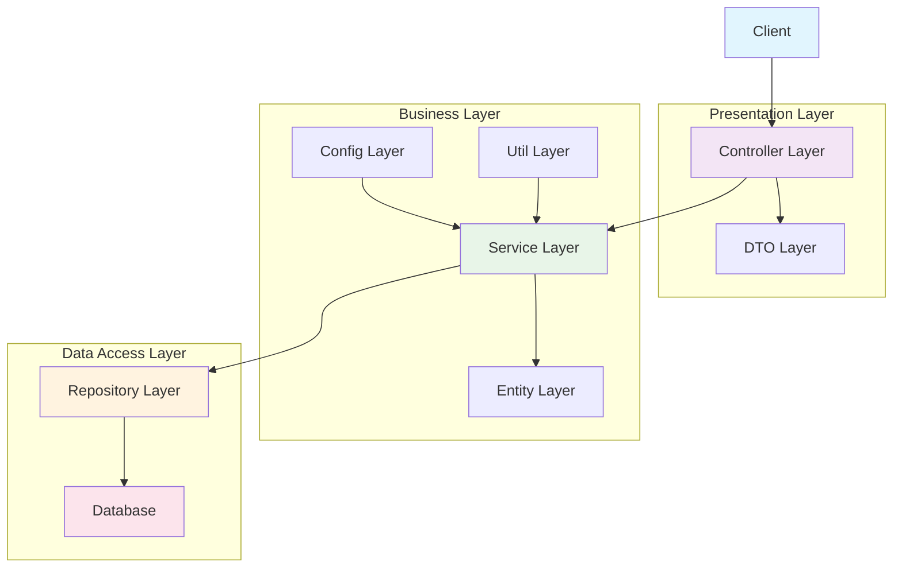
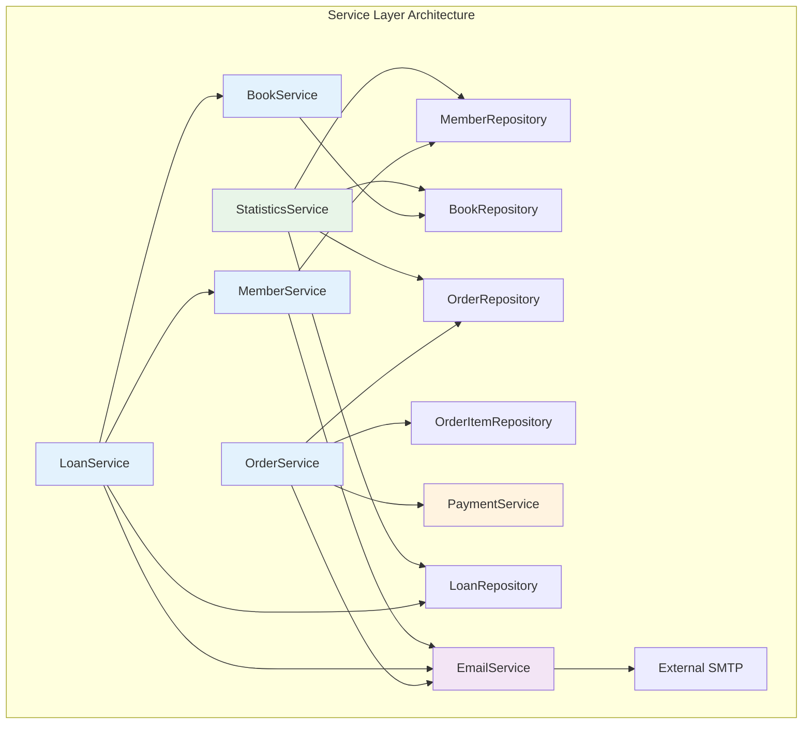

# 도서 주문 및 대여 시스템 기능명세서

## 1. 시스템 아키텍처

### 1.1 전체 구조



#### 계층별 역할

| 계층 | 역할 | 주요 구성요소 |
|------|------|---------------|
| **Presentation Layer** | 클라이언트 요청 처리 및 응답 | Controller, DTO |
| **Business Layer** | 비즈니스 로직 처리 | Service, Entity, Config |
| **Data Access Layer** | 데이터 저장 및 조회 | Repository, Database |

### 1.2 패키지 구조
```
com.example.spring
├── config/          # 설정 클래스
│   ├── BookstoreConfig.java
│   └── BookstoreProperties.java
├── controller/      # REST 컨트롤러
│   ├── MemberController.java
│   ├── BookController.java
│   ├── OrderController.java
│   └── LoanController.java
├── dto/            # 데이터 전송 객체
│   ├── request/    # 요청 DTO
│   └── response/   # 응답 DTO
├── entity/         # JPA 엔티티
│   ├── Member.java
│   ├── Book.java  
│   ├── Order.java
│   ├── OrderItem.java
│   └── Loan.java
├── repository/     # 데이터 접근 계층
│   ├── MemberRepository.java
│   ├── BookRepository.java
│   ├── OrderRepository.java
│   ├── LoanRepository.java
│   └── impl/       # JPA 구현체
├── service/        # 비즈니스 로직 계층 ⭐️
│   ├── MemberService.java
│   ├── BookService.java
│   ├── OrderService.java
│   ├── LoanService.java
│   ├── PaymentService.java
│   ├── EmailService.java
│   ├── StatisticsService.java
│   └── impl/       # 서비스 구현체
├── exception/      # 커스텀 예외
└── util/          # 유틸리티 클래스
```

### 1.3 Service Layer 상세 구조



## 2. Service Layer 상세 설계

### 2.1 MemberService (회원 서비스)

#### 인터페이스 정의
```java
public interface MemberService {
    // 회원 관리
    MemberResponse createMember(CreateMemberRequest request);
    MemberResponse updateMember(Long id, UpdateMemberRequest request);
    MemberResponse findMemberById(Long id);
    List<MemberResponse> findAllMembers(Pageable pageable);
    void deleteMember(Long id);
    
    // 회원 검색
    List<MemberResponse> findMembersByName(String name);
    List<MemberResponse> findMembersByMembershipType(MembershipType type);
    
    // 비즈니스 로직
    void upgradeMembership(Long memberId, MembershipType newType);
    boolean validateEmailDuplicate(String email);
    MemberLoanLimitInfo getMemberLoanLimitInfo(Long memberId);
}
```

#### 주요 비즈니스 로직
- **이메일 중복 검증**: 회원 가입 시 이메일 유니크 체크
- **멤버십 업그레이드**: 결제 검증 후 멤버십 타입 변경
- **대여 제한 확인**: 멤버십별 대여 가능 권수 조회

### 2.2 BookService (도서 서비스)

#### 인터페이스 정의
```java
public interface BookService {
    // 도서 관리
    BookResponse createBook(CreateBookRequest request);
    BookResponse updateBook(Long id, UpdateBookRequest request);
    BookResponse findBookById(Long id);
    List<BookResponse> findAllBooks(Pageable pageable);
    void deleteBook(Long id);
    
    // 도서 검색
    List<BookResponse> searchBooks(BookSearchRequest request);
    List<BookResponse> findBooksByAuthor(String author);
    List<BookResponse> findAvailableBooks();
    
    // 비즈니스 로직
    boolean checkBookAvailability(Long bookId);
    void updateBookAvailability(Long bookId, boolean available);
    BookStatisticsResponse getBookStatistics(Long bookId);
}
```

#### 주요 비즈니스 로직
- **재고 관리**: 도서 대여 시 가용성 체크 및 업데이트
- **검색 기능**: 제목, 저자, ISBN 등 다양한 조건으로 검색
- **통계 정보**: 도서별 대여 횟수, 인기도 계산

### 2.3 OrderService (주문 서비스)

#### 인터페이스 정의
```java
public interface OrderService {
    // 주문 관리
    OrderResponse createOrder(CreateOrderRequest request);
    OrderResponse updateOrderStatus(Long orderId, OrderStatus status);
    OrderResponse findOrderById(Long id);
    List<OrderResponse> findAllOrders(Pageable pageable);
    
    // 주문 처리
    OrderResponse processOrder(Long orderId);
    OrderResponse cancelOrder(Long orderId, String reason);
    
    // 비즈니스 로직
    BigDecimal calculateTotalAmount(List<Long> bookIds);
    void validateOrderItems(List<Long> bookIds);
    OrderPaymentInfo preparePayment(Long orderId);
}
```

#### 주요 비즈니스 로직
- **주문 금액 계산**: 도서별 가격 합산 및 할인 적용
- **재고 검증**: 주문 도서의 재고 확인
- **상태 관리**: 주문 상태별 비즈니스 규칙 적용

### 2.4 LoanService (대여 서비스)

#### 인터페이스 정의
```java
public interface LoanService {
    // 대여 관리
    LoanResponse loanBook(LoanBookRequest request);
    LoanResponse returnBook(Long loanId);
    LoanResponse renewLoan(Long loanId);
    
    // 대여 조회
    List<LoanResponse> findMemberLoans(Long memberId);
    List<LoanResponse> findOverdueLoans();
    List<LoanResponse> findActiveLoans();
    
    // 비즈니스 로직
    boolean canLoanBook(Long memberId, Long bookId);
    BigDecimal calculateOverdueFee(Long loanId);
    void sendReturnReminder(Long memberId);
    LoanLimitCheckResult checkLoanLimit(Long memberId);
}
```

#### 주요 비즈니스 로직
- **대여 가능성 검증**: 회원 상태, 대여 제한, 도서 가용성 종합 판단
- **연체료 계산**: 반납 지연일수에 따른 연체료 산정
- **자동 알림**: 반납 예정일 임박 시 리마인더 발송

### 2.5 PaymentService (결제 서비스)

#### Strategy 패턴 적용
```java
public interface PaymentService {
    PaymentResult processPayment(PaymentRequest request);
    PaymentResult refund(RefundRequest request);
    PaymentStatus checkPaymentStatus(String transactionId);
}

// Strategy 인터페이스
public interface PaymentStrategy {
    PaymentResult process(PaymentRequest request);
    boolean supports(PaymentMethod method);
}

// 구체적인 전략들
@Component
public class CreditCardPaymentStrategy implements PaymentStrategy {
    @Override
    public PaymentResult process(PaymentRequest request) {
        // 신용카드 결제 로직
        return validateCard(request.getCardInfo())
            .then(processCardPayment(request))
            .then(sendPaymentConfirmation(request));
    }
}

@Component  
public class BankTransferPaymentStrategy implements PaymentStrategy {
    @Override
    public PaymentResult process(PaymentRequest request) {
        // 계좌이체 결제 로직
        return validateAccount(request.getAccountInfo())
            .then(processTransfer(request))
            .then(sendTransferConfirmation(request));
    }
}
```

### 2.6 EmailService (이메일 서비스)

#### 인터페이스 정의
```java
public interface EmailService {
    // 기본 이메일 발송
    void sendEmail(EmailRequest request);
    void sendHtmlEmail(HtmlEmailRequest request);
    
    // 비즈니스 이메일
    void sendWelcomeEmail(Member member);
    void sendOrderConfirmationEmail(Order order);
    void sendLoanConfirmationEmail(Loan loan);
    void sendReturnReminderEmail(Loan loan);
    void sendOverdueNotificationEmail(Loan loan);
    void sendMembershipUpgradeEmail(Member member);
}
```

#### 이메일 템플릿 관리
```java
@Service
public class EmailTemplateService {
    public String generateWelcomeEmail(Member member) {
        return templateEngine.process("welcome", 
            Map.of("memberName", member.getName(),
                   "joinDate", member.getJoinDate()));
    }
    
    public String generateOverdueNotification(Loan loan) {
        return templateEngine.process("overdue-notification",
            Map.of("memberName", loan.getMember().getName(),
                   "bookTitle", loan.getBook().getTitle(),
                   "dueDate", loan.getDueDate(),
                   "overdueFee", calculateOverdueFee(loan)));
    }
}
```

### 2.7 StatisticsService (통계 서비스)

#### 인터페이스 정의
```java
public interface StatisticsService {
    // 대여 통계
    LoanStatisticsResponse getLoanStatistics(StatisticsFilter filter);
    List<PopularBookResponse> getPopularBooks(int limit);
    MemberLoanStatisticsResponse getMemberLoanStatistics(Long memberId);
    
    // 주문 통계  
    OrderStatisticsResponse getOrderStatistics(StatisticsFilter filter);
    SalesStatisticsResponse getSalesStatistics(StatisticsFilter filter);
    
    // 종합 통계
    DashboardStatisticsResponse getDashboardStatistics();
    TrendAnalysisResponse getTrendAnalysis(StatisticsFilter filter);
}
```

#### 통계 계산 로직
```java
@Service
public class StatisticsServiceImpl implements StatisticsService {
    
    @Cacheable("loan-statistics")
    public LoanStatisticsResponse getLoanStatistics(StatisticsFilter filter) {
        // 복잡한 집계 쿼리 실행
        Map<String, Object> stats = loanRepository.getLoanStatistics(
            filter.getStartDate(), filter.getEndDate());
            
        return LoanStatisticsResponse.builder()
            .totalLoans((Long) stats.get("totalLoans"))
            .activeLoans((Long) stats.get("activeLoans"))
            .overdueLoans((Long) stats.get("overdueLoans"))
            .averageLoanDuration((Double) stats.get("avgDuration"))
            .build();
    }
}
```

## 3. 핵심 기능 명세

### 3.1 회원 관리 기능

#### 2.1.1 회원 가입 (Member Registration)
- **기능 ID**: FUNC-001
- **기능명**: 회원 가입
- **설명**: 새로운 회원을 등록하는 기능

**입력 파라미터:**
```json
{
  "name": "홍길동",
  "email": "hong@example.com"
}
```

**처리 로직:**
1. 이메일 중복 검증 (`MemberRepository.existsByEmail()`)
2. Member 엔티티 생성 (기본 멤버십: REGULAR)
3. 가입일 설정 (현재 시각)
4. 데이터베이스 저장 (`MemberRepository.save()`)
5. 환영 이메일 발송 (`EmailService.sendWelcomeEmail()`)

**출력 결과:**
```json
{
  "id": 1,
  "name": "홍길동",
  "email": "hong@example.com",
  "membershipType": "REGULAR",
  "joinDate": "2024-01-15T10:30:00"
}
```

**예외 처리:**
- 이메일 중복 시: `DuplicateEmailException`
- 필수 필드 누락 시: `ValidationException`

#### 2.1.2 회원 조회 (Member Inquiry)
- **기능 ID**: FUNC-002
- **기능명**: 회원 정보 조회
- **API 엔드포인트**: `GET /api/members/{id}`

**처리 로직:**
1. 회원 ID로 회원 조회 (`MemberRepository.findById()`)
2. 회원 정보 반환

**출력 결과:**
```json
{
  "id": 1,
  "name": "홍길동",
  "email": "hong@example.com",
  "membershipType": "REGULAR",
  "joinDate": "2024-01-15T10:30:00"
}
```

#### 2.1.3 회원 목록 조회 (Member List)
- **기능 ID**: FUNC-003
- **기능명**: 회원 목록 조회
- **API 엔드포인트**: `GET /api/members`

**쿼리 파라미터:**
- `membershipType` (optional): 멤버십 타입별 필터링
- `name` (optional): 이름 검색
- `page` (optional): 페이지 번호 (기본값: 0)
- `size` (optional): 페이지 크기 (기본값: 20)

### 2.2 도서 관리 기능

#### 2.2.1 도서 목록 조회 (Book List)
- **기능 ID**: FUNC-004
- **기능명**: 도서 목록 조회
- **API 엔드포인트**: `GET /api/books`

**처리 로직:**
1. 모든 도서 조회 (`BookRepository.findAll()`)
2. 도서 정보 반환

**출력 결과:**
```json
[
  {
    "id": 1,
    "title": "Clean Code",
    "author": "Robert C. Martin",
    "price": 45000,
    "isbn": "978-0132350884",
    "available": true,
    "createdDate": "2024-01-01T00:00:00"
  }
]
```

#### 2.2.2 도서 상세 조회 (Book Detail)
- **기능 ID**: FUNC-005
- **기능명**: 도서 상세 정보 조회
- **API 엔드포인트**: `GET /api/books/{id}`

### 2.3 주문 관리 기능

#### 2.3.1 주문 생성 (Order Creation)
- **기능 ID**: FUNC-006
- **기능명**: 주문 생성
- **API 엔드포인트**: `POST /api/orders`

**입력 파라미터:**
```json
{
  "bookIds": [1, 2, 3]
}
```

**처리 로직:**
1. 주문 도서 목록 검증 (`BookRepository.findById()`)
2. 총 금액 계산
3. Order 엔티티 생성 (상태: PENDING)
4. OrderItem 엔티티들 생성
5. 데이터베이스 저장
6. 주문 확인 이메일 발송

**출력 결과:**
```json
{
  "id": 1,
  "totalAmount": 120000,
  "orderDate": "2024-01-15T14:30:00",
  "status": "PENDING",
  "orderItems": [
    {
      "id": 1,
      "book": {
        "id": 1,
        "title": "Clean Code",
        "author": "Robert C. Martin",
        "price": 45000
      },
      "quantity": 1,
      "price": 45000
    }
  ]
}
```

#### 2.3.2 주문 목록 조회 (Order List)
- **기능 ID**: FUNC-007
- **기능명**: 주문 목록 조회
- **API 엔드포인트**: `GET /api/orders`

#### 2.3.3 주문 상세 조회 (Order Detail)
- **기능 ID**: FUNC-008
- **기능명**: 주문 상세 정보 조회
- **API 엔드포인트**: `GET /api/orders/{id}`

### 2.4 결제 기능 (Payment System)

#### 2.4.1 결제 처리 (Payment Processing)
- **기능 ID**: FUNC-009
- **기능명**: 결제 처리 (Strategy 패턴 적용)

**Strategy Pattern 구현:**
```java
// PaymentStrategy 인터페이스
public interface PaymentStrategy {
    PaymentResult process(PaymentRequest request);
}

// 구체적인 전략들
public class CreditCardStrategy implements PaymentStrategy { ... }
public class BankTransferStrategy implements PaymentStrategy { ... }

// 컨텍스트
public class PaymentContext {
    private PaymentStrategy strategy;
    
    public PaymentResult processPayment(PaymentRequest request) {
        return strategy.process(request);
    }
}
```

**지원 결제 방식:**
1. **신용카드 결제** (`CreditCardStrategy`)
   - 카드번호, 유효기간, CVV 검증
   - 외부 결제 게이트웨이 연동 (Mock)

2. **계좌이체** (`BankTransferStrategy`)
   - 계좌번호, 은행코드 검증
   - 계좌 잔액 확인 (Mock)

### 2.5 대여 관리 기능

#### 2.5.1 도서 대여 (Book Loan)
- **기능 ID**: FUNC-010
- **기능명**: 도서 대여
- **API 엔드포인트**: `POST /api/loans`

**입력 파라미터:**
```json
{
  "memberId": 1,
  "bookId": 1
}
```

**처리 로직:**
1. 회원 존재 및 상태 확인 (`MemberRepository.findById()`)
2. 도서 대여 가능 여부 확인 (`LoanRepository.existsByBookIdAndReturnDateIsNull()`)
3. 회원 대여 권수 제한 확인 (`LoanRepository.findByMemberIdAndReturnDateIsNull()`)
4. Loan 엔티티 생성
5. 대여일 설정 (현재 시각)
6. 반납 예정일 설정 (2주 후)
7. 데이터베이스 저장

**멤버십별 대여 제한:**
- `REGULAR`: 최대 5권
- `PREMIUM`: 최대 10권
- `SUSPENDED`: 대여 불가

**출력 결과:**
```json
{
  "id": 1,
  "member": {
    "id": 1,
    "name": "홍길동"
  },
  "book": {
    "id": 1,
    "title": "Clean Code"
  },
  "loanDate": "2024-01-15T10:00:00",
  "dueDate": "2024-01-29T10:00:00",
  "returnDate": null
}
```

#### 2.5.2 도서 반납 (Book Return)
- **기능 ID**: FUNC-011
- **기능명**: 도서 반납
- **API 엔드포인트**: `PUT /api/loans/{id}/return`

**처리 로직:**
1. 대여 정보 조회 (`LoanRepository.findById()`)
2. 반납일 설정 (현재 시각)
3. 연체료 계산 (반납 예정일 초과 시)
4. 데이터베이스 업데이트

#### 2.5.3 대여 목록 조회 (Loan List)
- **기능 ID**: FUNC-012
- **기능명**: 대여 목록 조회

**API 엔드포인트들:**
- `GET /api/loans` - 전체 대여 목록
- `GET /api/loans/member/{memberId}` - 회원별 대여 목록
- `GET /api/loans/overdue` - 연체 목록
- `GET /api/loans/active` - 미반납 목록

### 2.6 통계 기능

#### 2.6.1 대여 통계 (Loan Statistics)
- **기능 ID**: FUNC-013
- **API 엔드포인트**: `GET /api/statistics/loans`

**쿼리 파라미터:**
- `startDate`: 시작일
- `endDate`: 종료일

**통계 정보:**
- 기간별 대여 건수
- 인기 도서 순위
- 회원별 대여 현황

## 3. 데이터 모델 명세

### 3.1 Entity 관계도
```
Member (1) ------ (N) Loan (N) ------ (1) Book
                              |
                              |
Order (1) ------ (N) OrderItem (N) ---- (1) Book
```

### 3.2 주요 Entity 명세

#### 3.2.1 Member Entity
```java
@Entity
@Table(name = "member")
public class Member {
    @Id
    @GeneratedValue(strategy = GenerationType.IDENTITY)
    private Long id;
    
    @Column(nullable = false)
    private String name;
    
    @Column(nullable = false, unique = true)
    private String email;
    
    @Enumerated(EnumType.STRING)
    private MembershipType membershipType;
    
    private LocalDateTime joinDate;
}
```

#### 3.2.2 Book Entity
```java
@Entity
@Table(name = "book")
public class Book {
    @Id
    @GeneratedValue(strategy = GenerationType.IDENTITY)
    private Long id;
    
    @Column(nullable = false)
    private String title;
    
    @Column(nullable = false)
    private String author;
    
    @Column(nullable = false)
    private BigDecimal price;
    
    private String isbn;
    private Boolean available;
    private LocalDateTime createdDate;
}
```

#### 3.2.3 Order Entity
```java
@Entity
@Table(name = "orders")
public class Order {
    @Id
    @GeneratedValue(strategy = GenerationType.IDENTITY)
    private Long id;
    
    @OneToMany(mappedBy = "order", cascade = CascadeType.ALL)
    private List<OrderItem> orderItems;
    
    @Column(nullable = false)
    private BigDecimal totalAmount;
    
    @Column(nullable = false)
    private LocalDateTime orderDate;
    
    @Enumerated(EnumType.STRING)
    private OrderStatus status;
}
```

#### 3.2.4 Loan Entity
```java
@Entity
@Table(name = "loan")
public class Loan {
    @Id
    @GeneratedValue(strategy = GenerationType.IDENTITY)
    private Long id;
    
    @ManyToOne(fetch = FetchType.LAZY)
    private Member member;
    
    @ManyToOne(fetch = FetchType.LAZY)
    private Book book;
    
    private LocalDateTime loanDate;
    private LocalDateTime dueDate;
    private LocalDateTime returnDate;
}
```

## 4. API 명세

### 4.1 공통 응답 형식
```json
{
  "success": true,
  "data": { ... },
  "message": "성공",
  "timestamp": "2024-01-15T10:30:00"
}
```

### 4.2 오류 응답 형식
```json
{
  "success": false,
  "error": {
    "code": "VALIDATION_ERROR",
    "message": "입력값이 올바르지 않습니다",
    "details": [
      {
        "field": "email",
        "message": "이메일 형식이 올바르지 않습니다"
      }
    ]
  },
  "timestamp": "2024-01-15T10:30:00"
}
```

### 4.3 HTTP 상태 코드
- `200 OK`: 성공
- `201 Created`: 생성 성공
- `400 Bad Request`: 잘못된 요청
- `404 Not Found`: 리소스 없음
- `409 Conflict`: 중복 등의 충돌
- `500 Internal Server Error`: 서버 오류

## 5. 비즈니스 규칙

### 5.1 대여 규칙
1. **대여 권수 제한**
   - REGULAR: 5권
   - PREMIUM: 10권
   - SUSPENDED: 0권

2. **대여 기간**
   - 기본 대여 기간: 14일

3. **연체 처리**
   - 연체 1일당 100원 연체료
   - 연체 30일 이상 시 계정 일시 정지

### 5.2 주문 규칙
1. **주문 상태 변경**
   - PENDING → CONFIRMED → SHIPPED → DELIVERED
   - 어느 단계에서든 CANCELLED 가능

2. **재고 관리**
   - 주문 시 재고 확인 (현재는 단순 available 체크)

## 6. 성능 고려사항

### 6.1 데이터베이스 최적화
1. **인덱스 설정**
   - Member.email (유니크 인덱스)
   - Loan.memberId, bookId, returnDate (복합 인덱스)
   - Order.orderDate (인덱스)

2. **쿼리 최적화**
   - N+1 문제 방지를 위한 @EntityGraph 사용
   - 페이징 처리를 위한 Pageable 활용

### 6.2 캐싱 전략
1. **도서 정보 캐싱**
   - 자주 조회되는 도서 정보는 Redis 캐싱 고려

2. **통계 데이터 캐싱**
   - 대여 통계 등은 주기적으로 갱신하여 캐싱